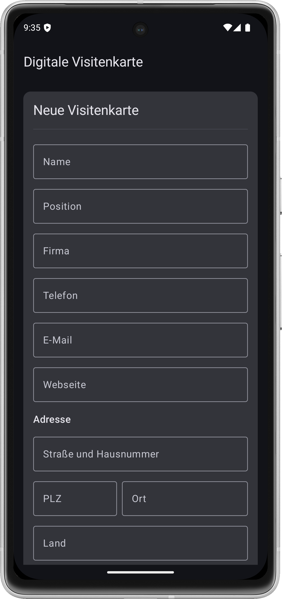
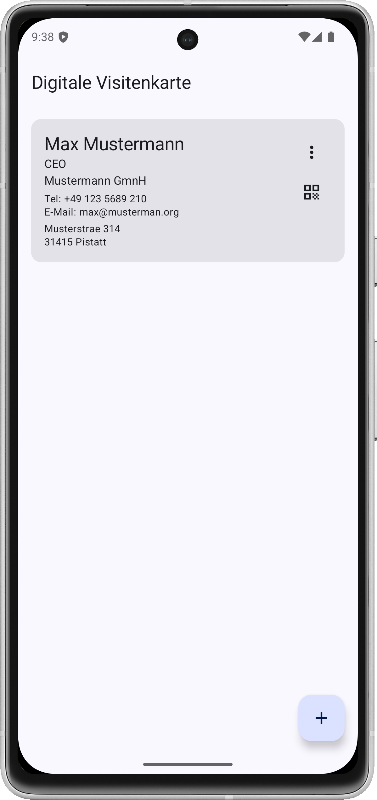
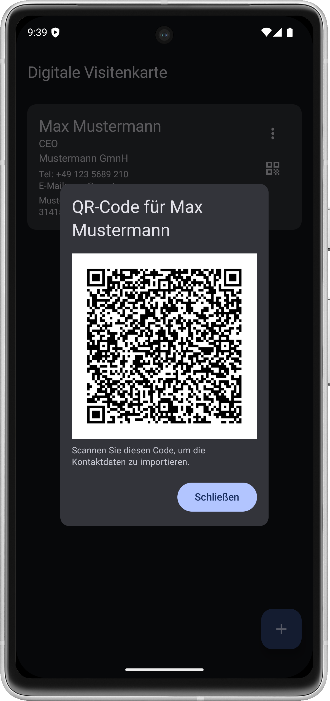

# DvCard - Digital Business Cards with QR Codes

## Overview
DvCard (Digital vCard) is an Android app for managing multiple digital business cards. Each card displays your contact information and generates a QR code in vCard format, allowing others to easily import your details by scanning the code.

## Features
- Manage multiple business cards (personal and professional)
- Clean visual presentation of contact details
- Automatic QR code generation for each card in vCard format
- Easy editing, creation, and deletion of contact information
- Persistent storage of cards on your device
- Play Store QR code for easy app sharing
- Transparent development with GitHub repository access

## Screenshots
 

## Website URL: https://enthali.github.io/DvCard/
https://dvcard.drachen-fels.de/

## Technical Details
### Technology Stack
- Kotlin programming language
- Jetpack Compose UI framework
- Room database for persistent storage
- ZXing for QR code generation
- Kotlin DSL build system (build.gradle.kts)

### App Architecture
The app follows a lightweight MVVM pattern:
- **Model**: Room database with Entity and DAO
- **ViewModel**: Manages data and UI states
- **View**: Compose UI with reactive updates

## Installation
The app is available on the Google Play Store:

## Development
For information about setting up the development environment, contributing to this project, and planned optimizations, please see the [CONTRIBUTING.md](CONTRIBUTING.md) file.

## License
[MIT License](LICENSE)
